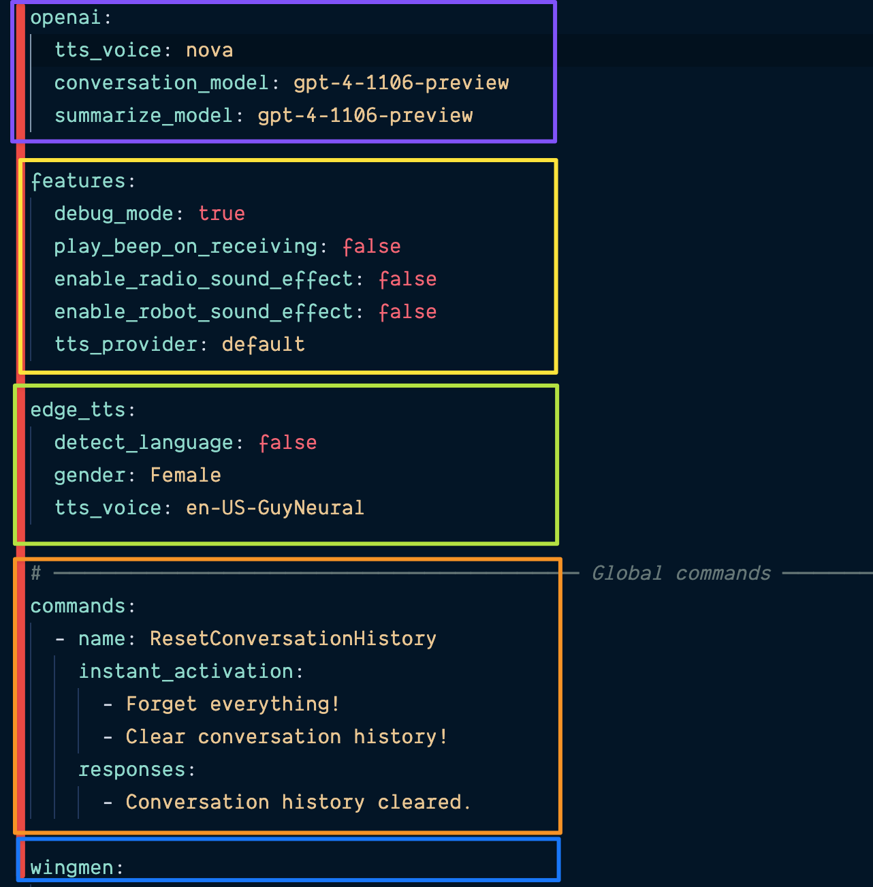
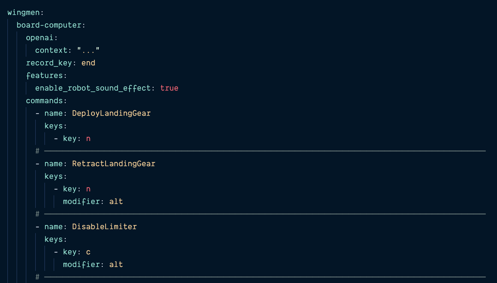
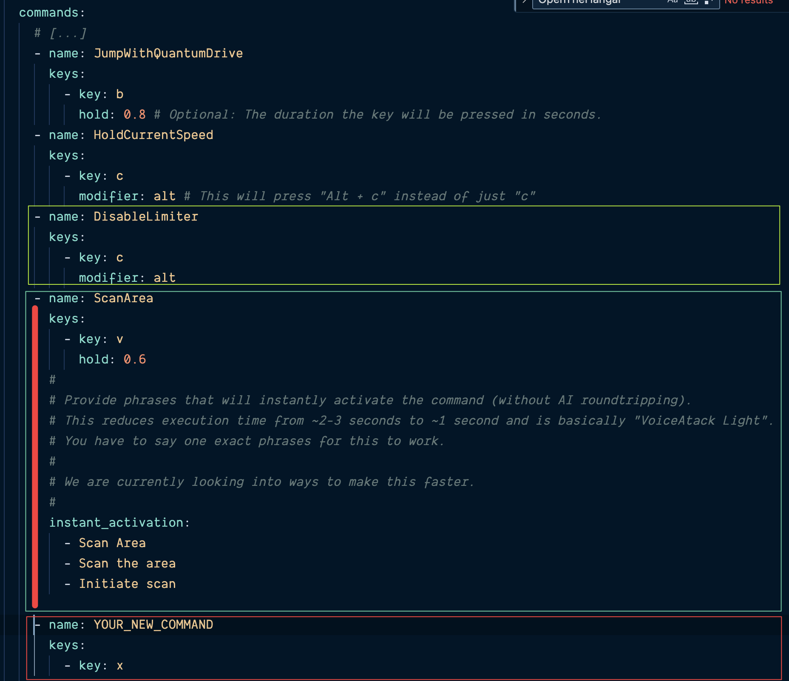
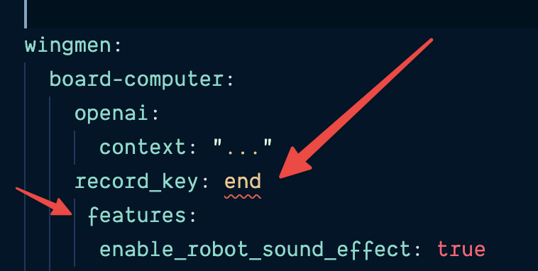

# Frequently Asked Questions

- [Can I just add new config sections and settings for my custom Wingman?](#can-i-just-add-new-config-sections-and-settings-for-my-custom-wingman)

- [Configuring Wingman AI](#configuring-wingman-ai)

- [How can I change the language?](#how-can-i-change-the-language)

- [I'm a Patreon supporter, but not mentioned here](#i'm-a-patreon-supporter,-but-not-mentioned-here)

- [StarHead API Issues](#starhead-api-issues)

- [What voices are available in EdgeTTS?](#what-voices-are-available-in-edgetts)

- [Why does it take so long for the voice responses to play?](#why-does-it-take-so-long-for-the-voice-responses-to-play)

- [Windows: How to change the audio device for output?](#windows:-how-to-change-the-audio-device-for-output)

- [Wingman does not start](#wingman-does-not-start)

## Can I just add new config sections and settings for my custom Wingman?

Yes, you can! We take all the "general" sections (currently: `openai`, `features` and `edge_tts`) from the top of the config, and then copy the wingman config section over, so that the wingman always takes precedence.

So if you want to override something, just mirror the general structure in your wingman config:

`features > tts_provider: default` is overridden by `my-wingman > features > tts_provider: edge_tts`.

Because of this mechanism, you can also add completely new config settings and sections to your custom Wingman. Just add something new to your wingman's config, override `Wingman.validate()` to validate it if necessary, and then you can use it safely.

## Configuring Wingman AI

Everything you can change (as non-dev) is stored in the `config.yaml` file.

**Be careful: It is very indentation-sensitive**!

Please **DO NOT** use the `SPACE` bar to indent lines in the config. Use the `TAB` key instead. Always use a single `TAB` to indent. If you're using an editor that automatically converts `TAB` to `SPACE`, please disable this feature for this file.

The file is very **hierarchical**, meaning that entries _belong_ to other entries. The file begins with a general section. These are global (default) settings for all your wingmen.

The screenshot shows the general section of the config file. It has several sections or entries (colored), and these are all siblings to each other, meaning they have the same indentation level and must _align_ perfectly with each other.

After the general section come the wingmen. Each wingman is defined in its own entry. They are all _children_ of the `wingmen` entry and siblings to each other. Then each wingman has its own commands and other settings.

You can override any setting from the general config in a specific wingman. For example, the `board-computer` wingman overrides the global `features > enable_robot_sound_effect: false` by mirroring the exact same structure with `wingmen > board-computer > features > enable_robot_sound_effect: true`.

Note also the `commands`. The general section defines a global `ResetConversationHistory`command, meaning that every wingman has this command. Then the`board-computer`wingman adds its own keystroke command to the command list. Also note that commands start with a`-`sign. This is because they are lists of commands. You can add as many commands as you like. Please do not remove the`-` sign and add it to your new commands.

## The context prompt

The context prompt describes the _character_ of your Wingman and controls how it behaves. It's a simple ChatGPT prompt that you can edit to your liking. You can do **a lot** with prompting, so play around with that.

You can use the [OpenAI ChatGPT web interface](https://chat.openai.com/) or our **no login required** [open source](https://github.com/ShipBit/slickgpt) tool called [SlickGPT](https://slickgpt.vercel.app/) to test your prompts.

Prompting is a science unto itself. If you want to get better at it, there are great resources like [learnprompting.org](https://learnprompting.org/).

## Adding and editing commands

Commands are the heart of the Wingman AI, as they add _functions_ to otherwise pure conversations. Commands are defined in `config.yaml` and are activated by the corresponding Wingman as a result of a conversation with you. In the first version, they are mainly used to trigger keystrokes, but they can also be used for other actions such as calling external APIs or executing complex scripts.

Here are the most important properties of a command:

- `name`: This is used to associate your request to the command. So make sure to give it a good name, e.g. `RequestLandingPermission`. Use `camelCasing` to separate words. No spaces and don't write everything in lowercase. You do not have to say a specific phrase to trigger the command because the AI is smart enough to detect which command you _meant_. This is a very powerful concept and one of the reason this is way better than other (sometimes "aggressive" 🤭) `voice-to-key` tools.
- `keys`: A list of keys to press. They will be triggered in the order they are defined. Any key can have these properties:
  - `key`: The key to press.
  - `modifier`: A modifier key to press with the key. _(optional)_
  - `hold`: The time to hold the key in milliseconds. _(optional)_
  - `wait`: The time to wait until the next key in this command is pressed _(optional)_
- `instant_activation`: A list of phrases that will trigger the command immediatale without AI round-tripping. _(optional)_
- `responses`: A list of responses. If the command is executed, a random response will be chosen and read out to you. _(optional)_

Your new command has to _line up_ with the ones before and starts with a `- name: Whatever line`. Align the `-` with the one from the command before. Indent everything under your command with a single `TAB` character as separator.

**Do not** cut the `instant_activation` from the previous command (the one in the screenshot belongs to the `ScanArea` command.

## Which keys are available in commands?

See the full list [here](https://pyautogui.readthedocs.io/en/latest/keyboard.html#keyboard-keys)

## Are there tools to help me?

Yaml is hard, we know. We're working on a more user-friendly interface to make it easier for you. For now, we recommend the following tools to help you out:

- [VSCode](https://code.visualstudio.com/) with the
- [YAML extension](https://marketplace.visualstudio.com/items?itemName=redhat.vscode-yaml)

Both are free and very easy to install and use. VSCode is a great editor for developers, and the YAML extension will help you with indentation by showing you errors and warnings in your config file as you type.

Notice how it has detected that something is wrong with the indentation. In this case, there is a single space before the `features` entry, which is not allowed. It also shows you visually how it should be indented.

It will get easier once you get used to it, we promise!

**Remember: Never use `SPACE`, always use `TAB`!**

## How can I change the language?

Wingman supports all languages that OpenAI (or your configured AI provider) supports. Setting this up in Wingman is really easy:

Find the `context` setting in `config.xaml` for the wingman you want to change.

Now add a simple sentence to the `context` prompt:

`Always answer in the language I'm using to talk to you.`

or something like:

`Always answer in Portuguese.`

The cool thing is that you can now trigger commands in the language of your choice without changing/translating the `name` of the commands - the AI will do that for you.

## I'm a Patreon supporter, but not mentioned here

Please contact us directly in [Discord](https://discord.gg/k8tTBar3gZ) or via [Patreon](https://www.patreon.com/ShipBit). Please **do not** open an issue on GitHub.

## StarHead API Issues

## I get errors on start before I can say anything or I get weird connection errors

Are you using Cloudflare DNS?

Try `nslookup https://api-test.star-head.de` in your terminal. If `Adress` is `1.1.1.1`, then you are.

If so, for now you can either change your DNS to something else (`8.8.8.8` is Google) or have to disable :wingman_ai: StarHead, sorry. We'll report this to the StarHead backend team.

## I get occasional errors

Please check the exact transcript text. Where there words misunderstood? Especially the API params `ship`, `location` or `money`?

We're aware of this issue and looking into it.

## What voices are available in EdgeTTS?

If you install EdgeTTS on your system, you can output all the voices in your terminal using `edge-tts --list-voices`.

[Here's a dump](docs/available-edge-tts-voices.md) of this list (taken 11/24/2023):

## Why does it take so long for the voice responses to play?

**Non-techie version:**.
It should be like using ChatGPT: You hit enter and it starts typing immediately. Only this time with speech. But that's not happening right now because the OpenAI API is broken. Instead, we have to wait for all the audio to be generated and then start playing it.

Dev version:
There is currently a [known issue](https://github.com/openai/openai-python/issues/864) with Open AI's TTS API that our community member _meenie_ discovered and reported to them. Basically, their audio streaming doesn't work in Python. This results in much higher latency when starting the TTS conversion. We're waiting for a fix.

Until then, you can always use another TTS provider like EdgeTTS or 11Labs.

## Windows: How to change the audio device for output?

Here's how to set the default sound output for a particular program on Windows 10 (and probably 11):

- Right-click the speaker icon in the system tray:
- There should be a speaker icon in the lower-right corner of your screen. Right-click it.
  Open the sound settings.
- Select "Open sound settings" from the context menu. This will open the sound settings window.
  Scroll down to "Advanced sound options"
- In the sound settings window, scroll down to the "Advanced sound options" section.
  Select the output device for each application
- Under the App volume and device settings section, you should see a list of open applications and their corresponding output devices. Use the drop-down menus to select the output device you want for each application.
  Note that not all applications might appear in this list, depending on whether the application supports individual sound output settings.

Thanks to our community member _EagleOne_ for posting this guide on our [Discord server](https://discord.com/invite/k8tTBar3gZ).

## Wingman does not start

Make sure you **DID NOT** extract Wingman to `C:\Program Files` or another directory that needs admin priviledges. Pick a user directory like your Desktop, Documents, Downloads etc instead.

Extract all the files from the `.zip` file, not just the `.exe`.

If it still doesn't work, please join our [Discord](https://discord.com/invite/k8tTBar3gZ) and provide a screenshot showing the error message.

Please do not create a new GitHub issue for that.

